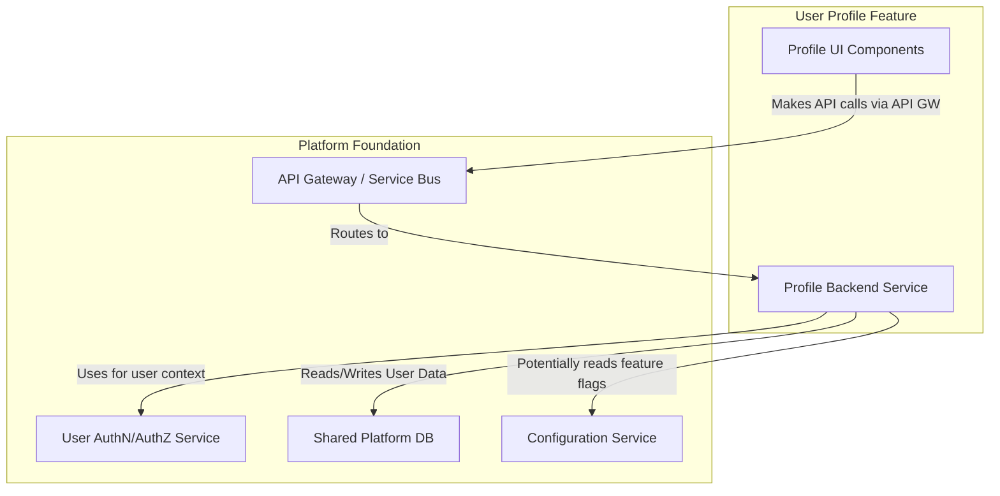

# Feature Product Requirements Document

**Product:** Platform Foundation
**Link to Main Product PRD:** ./PROD_PRD.md
**Feature Version:** 1.0.0
**Status:** In Development

## 1. Feature Introduction & Goals

### Feature Overview

This feature will allow registered users to view and update their profile information, including display name, bio, and contact preferences. It will also provide a section for users to manage their account settings, such as changing their password (delegating to the designated Authentication Service).

### User Problem/Need Addressed

Users currently have no way to personalize their visible information within the platform or manage basic account settings themselves after registration. This leads to a generic experience and reliance on administrative support for simple changes.

### Feature Goals & Objectives

- Provide users with the ability to view their current profile information
- Enable users to update mutable profile fields (e.g., display name, bio)
- Allow users to manage their notification preferences
- Offer a secure way for users to initiate a password change, interfacing with the platform's User AuthN/AuthZ Service
- Ensure profile updates are reflected across the platform where user information is displayed

### Success Metrics

- Percentage of registered users who have updated at least one profile field within 3 months of feature launch
- Reduction in support tickets related to user information changes
- Task completion rate for updating profile information (measured via analytics)
- Average time taken for a user to successfully update their profile

## 2. User Stories & Acceptance Criteria

### User Stories

#### User Story 2.1: View Profile Information

As a registered user, I want to be able to view my current profile information (email, display name, bio) so that I know what information is stored and displayed about me.

**Acceptance Criteria:**

- When I navigate to my profile page, I can see my registered email address (read-only)
- When I navigate to my profile page, I can see my current display name
- When I navigate to my profile page, I can see my current bio

#### User Story 2.2: Update Display Name

As a registered user, I want to be able to update my display name so that I can control how I am presented to other users.

**Acceptance Criteria:**

- On my profile page, there is an editable field for my display name
- After changing my display name and saving, the new display name is shown on my profile
- The updated display name must be between 3 and 50 characters
- An appropriate success message is displayed after a successful update

#### User Story 2.3: Update Bio

As a registered user, I want to be able to update my bio so that I can share more information about myself.

**Acceptance Criteria:**

- On my profile page, there is an editable text area for my bio
- After changing my bio and saving, the new bio is shown on my profile
- The bio can be up to 500 characters long
- An appropriate success message is displayed after a successful update

#### User Story 2.4: Change Password

As a registered user, I want to be able to change my password so that I can maintain the security of my account.

**Acceptance Criteria:**

- There is a "Change Password" option on my profile/account settings page
- Clicking "Change Password" securely redirects or prompts me to interface with the User AuthN/AuthZ Service's password change flow
- The feature itself does not handle current/new password fields directly but delegates this to the core AuthN service

## 3. Technical Specifications & Platform Integration

### Feature Architecture Overview



### Interaction with Core Platform Services

#### User AuthN/AuthZ Service

- **APIs/Endpoints Consumed:**
  - `ValidateToken(SessionToken) -> UserID|Error` (implicitly via API Gateway or middleware)
  - Potentially a `GetCurrentUserDetails(UserID)`
  - Password change initiation endpoint
- **Data Structures Exchanged:** UserID, SessionToken
- **Purpose:** Authenticate users and delegate password changes

#### API Gateway / Service Bus

- **APIs/Endpoints Consumed:** Feature's API endpoints
- **Data Structures Exchanged:** HTTP Requests/Responses
- **Purpose:** Securely expose Profile API Service

#### Configuration Service

- **APIs/Endpoints Consumed:** `GetConfig("profile-feature", environment)`
- **Data Structures Exchanged:** Configuration data
- **Purpose:** Fetch feature-specific configurations

### New Internal Components/Modules

#### Profile Backend Service

- **Purpose:** Handle profile data and expose APIs
- **Language/Framework:** Go with Gin/Echo
- **Key Interfaces/APIs:**
  - `GET /api/v1/profile`
  - `PUT /api/v1/profile`

#### Profile UI Components

- **Purpose:** Provide profile viewing and editing interface
- **Language/Framework:** SvelteKit
- **Key Interfaces/APIs:** Interacts with Profile Backend Service

### Database Requirements

#### Tables/Collections

```sql
CREATE TABLE IF NOT EXISTS user_profiles (
  user_id UUID PRIMARY KEY,
  display_name VARCHAR(50),
  bio TEXT,
  notification_preferences JSONB DEFAULT '{}',
  created_at TIMESTAMPTZ DEFAULT CURRENT_TIMESTAMP,
  updated_at TIMESTAMPTZ DEFAULT CURRENT_TIMESTAMP,
  CONSTRAINT fk_user
    FOREIGN KEY(user_id)
    REFERENCES core_users(id)
    ON DELETE CASCADE
);
```

### API Endpoints

#### GET /api/v1/users/{userId}/profile

- **Description:** Retrieve profile information
- **Request Body:** None
- **Response Body:**

```json
{
  "userId": "user-identifier",
  "email": "user@example.com",
  "displayName": "User Display Name",
  "bio": "User's biography.",
  "notificationPreferences": { /* ... */ },
  "updatedAt": "timestamp"
}
```

#### PUT /api/v1/users/{userId}/profile

- **Description:** Update profile information
- **Request Body:**

```json
{
    "displayName": "New User Display Name",
    "bio": "Updated user's biography.",
    "notificationPreferences": { /* ... */ }
}
```

- **Response Body:** Updated data

## 4. User Experience & Design

### User Flows

1. User navigates to "My Profile" from main navigation
2. User views current profile information
3. User clicks "Edit Profile"
4. Fields become editable. User modifies display name and/or bio
5. User clicks "Save Changes"
6. System validates input. On success, displays a confirmation message and updated profile. On error, shows contextual error messages
7. User clicks "Account Settings"
8. User clicks "Change Password"
9. User is guided through the AuthN Service's password change flow

### UI Components

- Profile View Screen
- Profile Edit Form
- Account Settings Section

### Accessibility

- All form fields will have associated labels
- Proper semantic HTML and ARIA attributes
- Sufficient color contrast
- Keyboard navigation support

## 5. Impact on Existing Platform

### Dependencies

- User AuthN/AuthZ Service
- API Gateway
- Shared Platform DB
- Core User Table

### Side Effects

- Other features displaying user information may need to integrate with profile data
- Potential increased load on services involved in profile data retrieval/updates

## 6. Out of Scope

- Profile picture/avatar uploads
- Linking external social media accounts
- Publicly viewable profiles
- Advanced profile customization

## 7. Platform Standards & Guidelines

### Standards Adherence

- Development will use languages and frameworks from `PROD_PRD.md`
- API design follows platform standards
- Code formatting follows project rules
- Feature interacts with services through defined API contracts

### Deviations

None anticipated. Any necessary deviations will be documented and approved.

## 8. Testing Strategy

### Test Types

- Unit tests for individual components
- Integration tests for service interactions
- API contract testing
- Database interaction testing
- **End-to-End (E2E) Tests:** Simulating complete user flows through the UI.

## 9. Open Questions / Risks (for this Feature)

- **Open Questions/Risks:**
  - Final strategy for data propagation/access by other features (real-time, event-based, direct API calls).
  - Specific PII handling and sanitization requirements for profile fields like 'bio'.
  - Detailed API contract for password change initiation with the User AuthN/AuthZ Service.
  - Performance implications and caching strategies for profile data.
